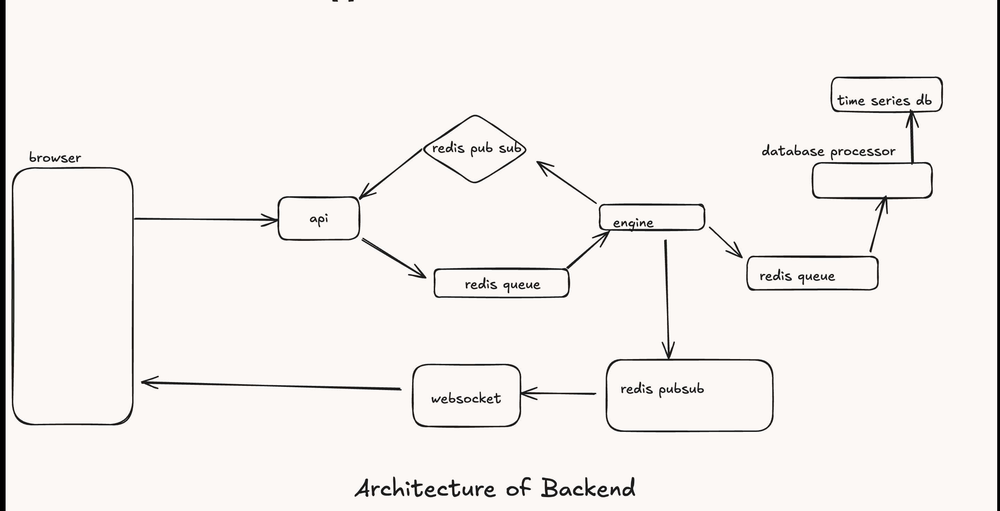

# Crypto Exchange Platform

A full-stack, real-time cryptocurrency exchange platform built with Next.js, TypeScript, Express, TimescaleDB, Redis, WebSocket, and Redis Pub/Sub. The system is designed for high performance, scalability, and real-time trading experiences.

---

## Table of Contents
- [Overview](#overview)
- [Architecture](#architecture)
- [Folder Structure](#folder-structure)
- [Technologies Used](#technologies-used)
- [Setup & Running Locally](#setup--running-locally)
- [Service Descriptions](#service-descriptions)
- [Contributing](#contributing)

---

## Overview
This project is a microservices-based cryptocurrency exchange platform. It supports real-time order matching, live orderbook and trade updates, and candlestick charting for multiple trading pairs. The system is built for extensibility and performance, using modern web and backend technologies.

---

## Architecture



- **Frontend** communicates with the backend via REST and WebSocket for real-time updates.
- **API** handles HTTP requests, routes, and aggregates data.
- **Engine** processes and matches orders, publishing events via Redis Pub/Sub.
- **DB Service** writes trades and price data to TimescaleDB.
- **WebSocket Service** streams live data to clients.
- **Market Maker** (optional) provides liquidity for testing/demo.

---

## Folder Structure

```
Exchange/
├── api/         # Express API Gateway (REST endpoints)
├── db/          # Database service (TimescaleDB, trade/price ingestion)
├── docker/      # Docker Compose and infra configs
├── engine/      # Order matching engine (core trading logic)
├── frontend/    # Next.js frontend (React, WebSocket, charting)
├── mm/          # Market maker bot (liquidity/testing)
├── ws/          # WebSocket server (real-time pub/sub)
```

---

## Technologies Used
- **Frontend:** Next.js, React, TypeScript, WebSocket
- **Backend:** Node.js, Express, TypeScript
- **Database:** TimescaleDB (PostgreSQL extension for time-series data)
- **Cache/Broker:** Redis (Pub/Sub)
- **Real-time:** WebSocket, Redis Pub/Sub
- **Infrastructure:** Docker, Docker Compose

---

## Setup & Running Locally

1. **Clone the repository:**
   ```bash
   git clone <repo-url>
   cd Exchange
   ```

2. **Start infrastructure (Redis, TimescaleDB):**
   ```bash
   cd docker
   docker-compose up -d
   ```

3. **Install dependencies and start each service:**
   - API: `cd api && npm install && npm run dev`
   - Engine: `cd engine && npm install && npm run dev`
   - DB: `cd db && npm install && npm run dev`
   - WebSocket: `cd ws && npm install && npm run dev`
   - Frontend: `cd frontend && npm install && npm run dev`
   - Market Maker (optional): `cd mm && npm install && npm run dev`

4. **Seed and refresh the database (if needed):**
   ```bash
   cd db
   npm run seed:db
   npm run refresh:views
   ```

5. **Access the app:**
   - Frontend: [http://localhost:3000](http://localhost:3000)

---

## Service Descriptions

### `/frontend`
- **Next.js** app for the trading UI
- Real-time orderbook, trades, and charting (candlesticks)
- Connects to backend via REST and WebSocket

### `/api`
- **Express** API gateway
- Handles REST endpoints for orders, tickers, trades, klines, and depth
- Communicates with engine, DB, and Redis

### `/engine`
- **Order matching engine** (TypeScript)
- Core trading logic: order matching, balance management, trade event publishing
- Publishes events to Redis for DB and WebSocket services

### `/db`
- **Database service** (TypeScript)
- Listens for trade events from Redis
- Writes trades and price data to TimescaleDB
- Manages materialized views for klines (candlesticks)

### `/ws`
- **WebSocket server** (TypeScript)
- Streams real-time orderbook, trade, and ticker updates to frontend
- Subscribes to Redis Pub/Sub for live data

### `/mm`
- **Market maker bot** (TypeScript)
- Automatically places buy/sell orders for liquidity/testing
- Useful for demo and development

### `/docker`
- **Docker Compose** configuration for Redis and TimescaleDB
- Infrastructure setup scripts

---

## Contributing
Pull requests and issues are welcome! Please open an issue to discuss your ideas or report bugs.

---

## License
MIT 